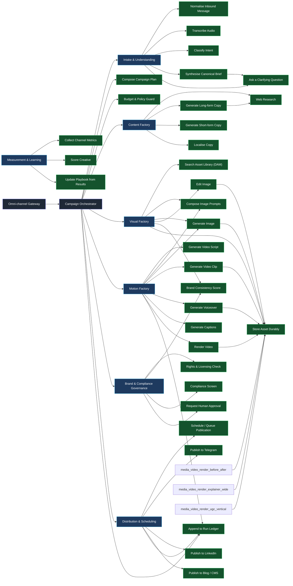

# Estate graph

Generated by `npm run graph`. Terminal capabilities with no dependents are omitted to keep the diagram readable — see `dist/capabilities.json` for the complete list.

```mermaid
graph LR
  classDef system fill:#1f2937,stroke:#6366f1,color:#fff
  classDef subsystem fill:#1e3a5f,stroke:#38bdf8,color:#fff
  classDef terminal fill:#14532d,stroke:#4ade80,color:#fff
  approve_human_request["Request Human Approval"]:::terminal
  asset_ledger_append["Append to Run Ledger"]:::terminal
  asset_store_put["Store Asset Durably"]:::terminal
  copy_localize["Localise Copy"]:::terminal
  copy_longform_generate["Generate Long-form Copy"]:::terminal
  copy_script_generate["Generate Video Script"]:::terminal
  copy_short_generate["Generate Short-form Copy"]:::terminal
  dist_publish_blog["Publish to Blog / CMS"]:::terminal
  dist_publish_linkedin["Publish to LinkedIn"]:::terminal
  dist_publish_telegram["Publish to Telegram"]:::terminal
  dist_schedule_enqueue["Schedule / Queue Publication"]:::terminal
  intake_audio_transcribe["Transcribe Audio"]:::terminal
  intake_clarification_request["Ask a Clarifying Question"]:::terminal
  intake_message_normalize["Normalise Inbound Message"]:::terminal
  learn_playbook_update["Update Playbook from Results"]:::terminal
  measure_creative_score["Score Creative"]:::terminal
  measure_metrics_collect["Collect Channel Metrics"]:::terminal
  media_audio_vo_generate["Generate Voiceover"]:::terminal
  media_captions_generate["Generate Captions"]:::terminal
  media_image_edit["Edit Image"]:::terminal
  media_image_generate["Generate Image"]:::terminal
  media_image_search["Search Asset Library (DAM)"]:::terminal
  media_video_clip_generate["Generate Video Clip"]:::terminal
  media_video_render["Render Video"]:::terminal
  ops_budget_check["Budget & Policy Guard"]:::terminal
  plan_brief_synthesize["Synthesise Canonical Brief"]:::terminal
  plan_campaign_compose["Compose Campaign Plan"]:::terminal
  prompt_image_compose["Compose Image Prompts"]:::terminal
  research_web_search["Web Research"]:::terminal
  understand_intent_classify["Classify Intent"]:::terminal
  verify_brand_score["Brand Consistency Score"]:::terminal
  verify_compliance_screen["Compliance Screen"]:::terminal
  verify_rights_check["Rights & Licensing Check"]:::terminal
  sub_content["Content Factory"]:::subsystem
  sub_distribution["Distribution & Scheduling"]:::subsystem
  sub_governance["Brand & Compliance Governance"]:::subsystem
  sub_intake["Intake & Understanding"]:::subsystem
  sub_measurement["Measurement & Learning"]:::subsystem
  sub_motion["Motion Factory"]:::subsystem
  sub_visual["Visual Factory"]:::subsystem
  sys_gateway["Omni-channel Gateway"]:::system
  sys_orchestrator["Campaign Orchestrator"]:::system
  copy_longform_generate --> research_web_search
  media_audio_vo_generate --> asset_store_put
  media_image_edit --> asset_store_put
  media_image_generate --> asset_store_put
  media_video_clip_generate --> asset_store_put
  media_video_render --> asset_store_put
  media_video_render_before_after --> asset_store_put
  media_video_render_explainer_wide --> asset_store_put
  media_video_render_ugc_vertical --> asset_store_put
  plan_brief_synthesize --> intake_clarification_request
  sub_content --> research_web_search
  sub_content --> copy_longform_generate
  sub_content --> copy_short_generate
  sub_content --> copy_localize
  sub_distribution --> dist_schedule_enqueue
  sub_distribution --> dist_publish_telegram
  sub_distribution --> dist_publish_linkedin
  sub_distribution --> dist_publish_blog
  sub_distribution --> asset_ledger_append
  sub_governance --> verify_rights_check
  sub_governance --> verify_brand_score
  sub_governance --> verify_compliance_screen
  sub_governance --> approve_human_request
  sub_intake --> intake_message_normalize
  sub_intake --> intake_audio_transcribe
  sub_intake --> understand_intent_classify
  sub_intake --> plan_brief_synthesize
  sub_intake --> intake_clarification_request
  sub_measurement --> measure_metrics_collect
  sub_measurement --> measure_creative_score
  sub_measurement --> learn_playbook_update
  sub_motion --> copy_script_generate
  sub_motion --> prompt_image_compose
  sub_motion --> media_image_generate
  sub_motion --> media_video_clip_generate
  sub_motion --> media_audio_vo_generate
  sub_motion --> media_captions_generate
  sub_motion --> media_video_render
  sub_motion --> asset_ledger_append
  sub_visual --> media_image_search
  sub_visual --> prompt_image_compose
  sub_visual --> media_image_generate
  sub_visual --> media_image_edit
  sub_visual --> verify_brand_score
  sub_visual --> asset_store_put
  sys_gateway --> sys_orchestrator
  sys_orchestrator --> sub_intake
  sys_orchestrator --> plan_campaign_compose
  sys_orchestrator --> ops_budget_check
  sys_orchestrator --> sub_content
  sys_orchestrator --> sub_visual
  sys_orchestrator --> sub_motion
  sys_orchestrator --> sub_governance
  sys_orchestrator --> sub_distribution
  sys_orchestrator --> asset_ledger_append
```
